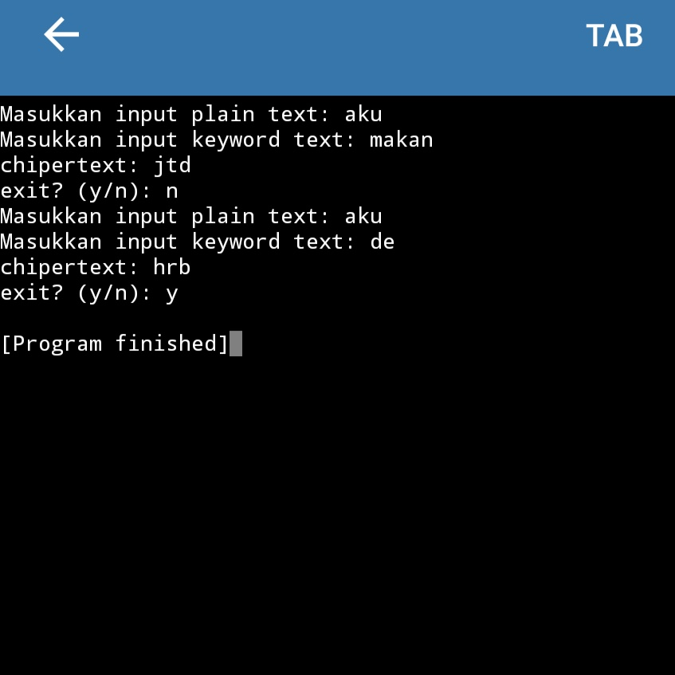

# UG03-StrukturDataBuiltIn

Buatlah sebuah program untuk melakukan enkripsi kata. Program akan meminta 2 input pengguna: pesan yang ingin dienkripsi dan kata kunci enkripsi. input tidak boleh menggunakan spasi, angka, atau huruf kapital. proses enkripsi ini dilakukan dengan cara mencari nilai dari setiap hurufnya lalu ditambahkan dengan nilai kata kuncinya. 
Contoh:

Pesan : aku

Kata Kunci : de

Pesan dan kata kunci akan diubah menjadi angka, dimulai dari 0

"aku"

a => 0

k => 10

u => 20

"de"

d => 3

e => 4

kita tambahkan "aku" dengan "de"

"de"

a => 0 + 3 + 4 = 7

k => 10 + 3 + 4 = 17

u => 20 + 3 + 4 = 27 => 1 (Kembali ke 0 ketika lebih ke 26)

Maka:

Kombinasi terakhir kan 7 17 1

7 = h

17 = r

1 = b

Hasil akhir : hrb

